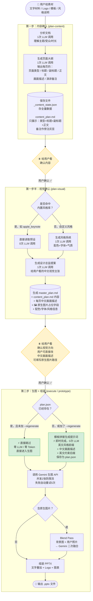

# Nano Banana PPT · 完整技术路径

> 最后更新：2026-03-13  
> 版本：v3.2（模板拼接架构，零 LLM 提示词生成）

---

## 一、整体流程图



---

## 二、每一步大白话说明

### 第一步（plan-content）

用户给进来文字材料，AI 先快速"看懂"这份文档（1次调用），然后按演讲逻辑把它拆成一页一页（1次调用）。每页生成：标题、副标题、正文、中文画面描述、演讲备注。

给用户看的 `content_plan.md` 只有最简洁的部分（标题 + 内容），演讲备注以灰色旁注形式展示，用户不需要修改，看一眼参考即可。

**视觉素材的处理**：如果用户在这一步提供了 Logo、模板、原生插图或风格说明，系统静默收集但不打断内容确认流程，等到第一步半再处理。

---

### 第一步半（plan-visual）

用户确认内容之后，视觉才介入。AI 做两件事：

1. **定义风格**：如果用户选的是内置风格（如 `apple_keynote`、`dark_luxury`），直接读预设，**不调 API**；如果是自定义描述，调一次 LLM。
2. **生成设计总监提案**：1次 LLM 调用，生成给用户看的中文视觉主张。

`master_plan.md` 是最终确认蓝图。**用户在这里直接编辑中文画面描述**——改完直接生效，不需要翻译，Gemini 本身是多语言模型，中文描述可以直接理解。

---

### 第二步（execute / prototype）

这是最关键的节点。以前每次都要"先把所有页的提示词重新生成一遍（每页一次 LLM 调用）"，现在完全不同了：

| 情况                              | 行为              | Token 消耗 |
| ------------------------------- | --------------- | -------- |
| plan.json 已存在，未加 `--regenerate` | 直接跳过提示词生成       | **零**    |
| plan.json 不存在                   | 模板拼接即时生成（字符串操作） | **零**    |
| 加了 `--regenerate`               | 重新拼接（用于修改画面描述后） | **零**    |
| 生图（Gemini API）                  | 每张图调用一次，并发 2 张  | **计费**   |

**prompt 的结构**（纯字符串拼接，无 LLM）：
```
[英文风格前缀: Style + Palette + Layout]
[页面类型指令: COVER / SECTION / CONTENT ...]
Deck Context: (全局大纲，保证各页风格一致)
Visual Scene: 一片星空下的山峰，象征高远志向   ← 用户的中文直接进去
TEXT TO RENDER EXACTLY: ...
RULES: ...（5条约束）
```

---

## 三、内容感知布局分配规则

对于普通内容页（`content` 类型），系统会根据正文内容自动选择最合适的布局，而不是死板地固定一种：

| 正文特征 | 分配的布局 |
|---|---|
| 没有正文 | `centered_headline`（居中大标题） |
| 含"步"/"第一"/"→"等步骤词 | `process_flow`（流程图式） |
| 4条以上且每条很短（<30字） | `bento_grid`（模块化网格） |
| 恰好3条 | `three_column_grid`（三栏） |
| 1-2条 | `left_text_right_visual`（左文右图） |
| 其他 | `top_visual_bottom_text`（上图下文） |

封面、章节、金句、封底等特殊页型，布局是固定的，不走内容分析逻辑。

---

## 四、文件结构说明

```
output/ppt/{date}_{project_name}/
├── content_plan.md          ← 第一步生成，内容大纲（给用户确认）
├── master_plan.md           ← 第一步半生成，完整蓝图（含画面描述，给用户确认）
├── plan.json                ← 第二步生成，技术执行计划（含 visual_prompt）
├── _content_state.json      ← 内部缓存，存 NarrativeAgent 完整输出
├── {date}_{name}.pptx       ← 最终交付文件
├── slides/
│   ├── slide_01.png         ← 每页生成的背景图
│   ├── slide_02.png
│   └── ...
└── template_assets/         ← 模板提取的参考图（如有）
```

---

## 五、已知卡点（待解决）

| #   | 卡点                               | 严重程度 | 说明与建议                                                                                                    |
| --- | -------------------------------- | ---- | -------------------------------------------------------------------------------------------------------- |
| 1   | ~~用户改了画面描述不知道要加 `--regenerate`~~ | ✅ 已修复 | SKILL.md 中已在每次 execute/prototype 前强制插入确认问句，有改动则自动加 `--regenerate` |
| 2   | **生图 API 限流导致灰页**                | ⚠️ 中 | 遇到长 PPT 还是会触发限流。出现灰页时用 `--slides N` 补跑指定页                                                                |
| 3   | ~~原生图片 Blend 功能不可用~~             | ✅ 已修复 | 改为两步式 Blend Pass：第一步生成干净背景，第二步将用户照片自动融合进去。用户在 master_plan.md 的「🖼️ 原生图片」字段填写绝对路径即可触发 |
| 4   | **plan-content 实际是 2 次 LLM 调用**  | 🔵 低 | `analyze_content` + `generate_narrative_outline` 分两次。技术上可合并，目前不是瓶颈                                       |
| 5   | **用户改内容后画面描述不自动更新**              | 🔵 低 | 画面描述来自 `_content_state.json`，用户在 content_plan 改了标题/正文，visual_suggestion 不会自动跟着变，需要在 master_plan.md 里手工调整 |

---

## 六、常用命令速查

```bash
# 第一步：生成内容大纲
python3 -m tools.nano_banana_ppt.main plan-content <内容文件> [--pages 15]

# 第一步半：生成视觉蓝图
python3 -m tools.nano_banana_ppt.main plan-visual <项目目录> [--style apple_keynote]

# 打样（默认自动选 2-3 页，每种页型各一）
python3 -m tools.nano_banana_ppt.main prototype <项目目录>

# 打样（指定页码）
python3 -m tools.nano_banana_ppt.main prototype <项目目录> --slides 1 3 7

# 全量生成
python3 -m tools.nano_banana_ppt.main execute <项目目录>

# 修改了画面描述后重新生成
python3 -m tools.nano_banana_ppt.main execute <项目目录> --regenerate

# 补跑失败的页面（灰页）
python3 -m tools.nano_banana_ppt.main execute <项目目录> --slides 5 8 12

# 仅重新组装 PPTX（不重新生图）
python3 -m tools.nano_banana_ppt.main execute <项目目录> --reassemble
```
